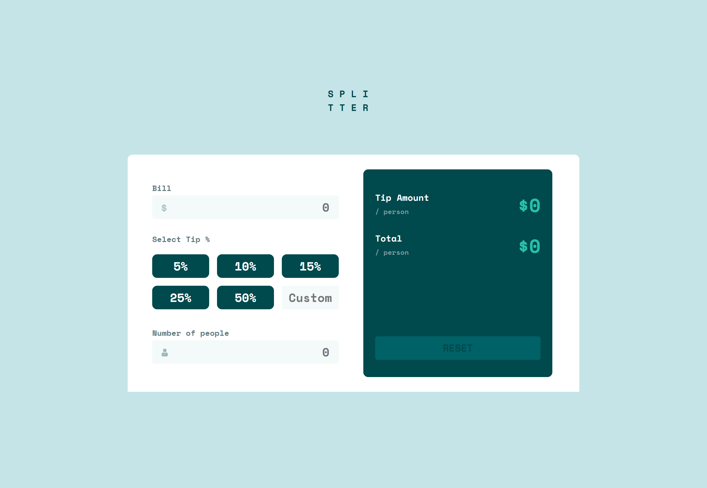
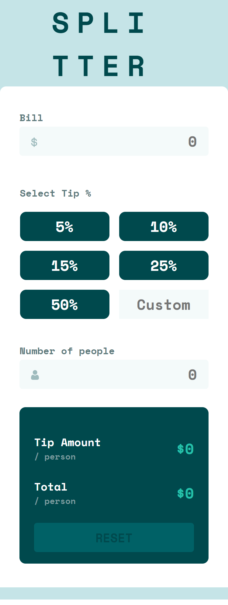

# Frontend Mentor - Tip calculator app solution

This is a solution to the [Tip calculator app challenge on Frontend Mentor](https://www.frontendmentor.io/challenges/tip-calculator-app-ugJNGbJUX). Frontend Mentor challenges help you improve your coding skills by building realistic projects.

## Table of contents

- [Overview](#overview)
  - [Screenshot](#screenshot)
  - [Links](#links)
- [My process](#my-process)
  - [Built with](#built-with)
- [Author](#author)

## Overview

### Screenshot

### Links

- Solution URL: [Github](https://github.com/Andersonvb/tip-calculator-app)
- Live Site URL: [Site](https://tip-calculator-app-roan-one.vercel.app/)

## My process

### Built with

- Semantic HTML5 markup
- CSS custom properties
- Flexbox
- CSS Grid
- Mobile-first workflow
- [React](https://reactjs.org/) - JS library

## Author

- Website - [Anderson Valencia](https://www.github.com/andersonvb)
- Frontend Mentor - [@andersonvb](https://www.frontendmentor.io/profile/andersonvb)
- Twitter - [@anderson_v_b](https://www.twitter.com/anderson_v_b)
